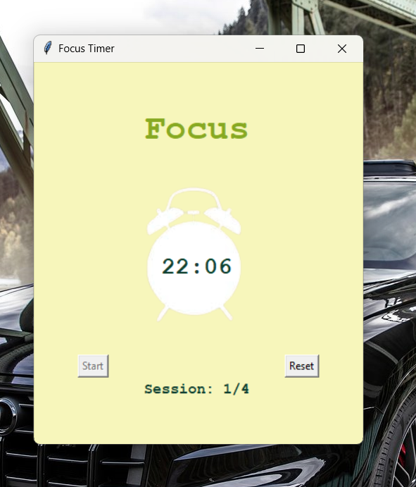

# Focus Timer App
## Overview
The Focus Timer App is a simple Python application designed to help users stay focused and productive by providing a customizable timer for work sessions and breaks.

## Features
- **Session Management**: The app allows users to define the duration of work sessions and breaks.
- **Countdown Timer**: During each session and break, a countdown timer is displayed to track the remaining time.
- **Audio Alert**: At the end of each session, an audio alert notifies the user to take a break, and vice versa. The <a href='https://www.pygame.org/docs/'>pygame</a> library is used to play the audio
- **Multiple Sessions**: Users can go through multiple sessions of work followed by breaks, helping to maintain focus over extended periods.
- **User Interface**: The app features a simple graphical user interface built using the <a href='https://tkdocs.com/tutorial/'>tkinter</a> library.

## Screenshots
The timer app interface

# Future Enhancement: Settings Popup
Looking to further enhance the user experience of the Focus Timer App? Consider implementing a settings popup window!

## Benefits
- **Improved Usability**: A settings popup window provides a convenient and intuitive interface for users to adjust settings without tampering with the code of the app.
- **Customization Options**: Users can customize parameters such as session duration, break duration, and number of sessions to better suit their workflow and preferences.
- **Enhanced User Control**: By offering a dedicated settings popup, users have more control over the app's behavior and can tailor it to their specific needs.

_Any other functionality can be added!_
